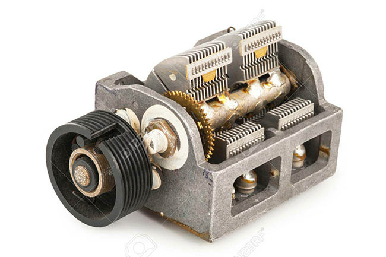
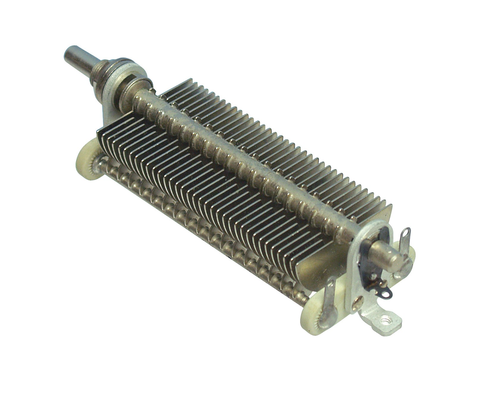

# Arduino library API for a variable Capacitor

## Description
I create this library to read (with an Arduino) the tuning of an old radio of the 50's.
On these models, the tuning button was a variable capacitor.



## Notes
_Capacity to measure_:
* The capacity to measure is between **in_pin** (Analog) and **out_pin** (Analog)  

_Stray Capacity (parasite)_:
* There is a Stray Capacitance between **Pin_In** and **Ground**.
* This Stray capacitance is always present. 

_Extra capacitance_:
* An extra capacitance can be added to allow higher capacitance to be measured.

## API description

-----
```c++
CapButton::CapButton(int in_pin, int out_pin)
```

Contructor.

-----
```c++
void CapButton::begin()
```

Initialisations.

-----
```c++
int CapButton::readValue()
```

On lit et renvoie la position de l'entrée digitale (valeur de 0 à 1023).
The capacitor under test is between Pin_out and Pin_In.

-----
```c++
int CapButton::getValue()
```

On renvoie la position lue la plus récente (valeur de 0 à 1023).

-----
```c++
int CapButton::getLastValue()
```

On renvoie la position lue précédente (valeur de 0 à 1023).

-----
```c++
bool CapButton::hasChanged()
```

Indique si le bouton a changé de position depuis le dernier appel à la fonction et s'est stabilisé.       

-----
```c++
int CapButton::captureMeanValue(int samples)
```

Effectue plusieurs mesures pour obtenir une moyenne.
Les valeurs mesurées vont de 340 à 120 (cad une amplitude de 220 env).
On les étale entre 0 et 1023.        

-----
```c++
int CapButton::chargeAndMesure()
```

Effectue une lecture de la valeur.
On envoie une impulsion sur Pin_Out et 0.1ms plus tard, on lit la valeur de Pin_In.

-----
```c++
void CapButton::dischargeCapacitor()
```

Décharge la Capa en mettant la masse sur les deux pins.

